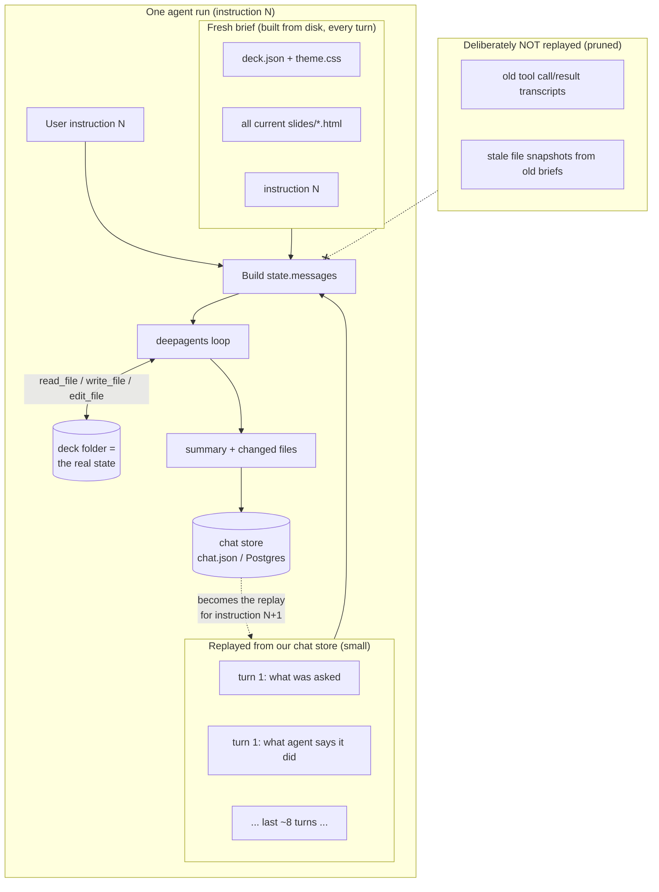
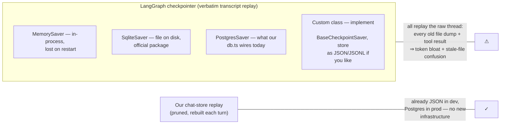

# Agent Memory: Pruned Conversation Replay

How the deck agent remembers (and deliberately forgets) across instructions.
Decision record + benchmark, 2026-07-11.

## The problem

LLMs are stateless: "memory" is always a transcript replayed on every call.
deepagents/LangGraph can persist that transcript via a **checkpointer** keyed
by `thread_id`, but we only wire one when `DATABASE_URL` is set (Postgres). In
JSON mode there is no checkpointer, so every instruction used to start a
brand-new conversation — the agent had no idea what was asked one turn ago
(this bit us: the no-change retry once reached the model with no memory of the
original request).

Checkpointers also replay the thread **verbatim**. Our per-turn brief embeds
the entire deck's file contents, so a verbatim replay drags every stale deck
snapshot and every old tool transcript back into context — token bloat plus
stale-file confusion.

## The design: prune the bulky-and-stale, keep the small-and-meaningful

Key properties:

- The deck folder is the real state; files always arrive fresh from disk, once.
- The replay carries only the conversational layer (instruction → summary per
  turn), so references like "do the same to the closing slide" resolve.
- The chat store is already JSON in dev and Postgres in prod — no new
  infrastructure, identical behavior in both modes.

## Why not "just enable a checkpointer"

A JSON/JSONL checkpointer is perfectly writable (`BaseCheckpointSaver` is a
small interface) — Postgres is not required by deepagents. It's the *verbatim*
part that's wrong for us, not the storage medium.

## Configuration

`AGENT_HISTORY_TURNS` (default 8): number of prior chat messages replayed into
the agent's context per run. `0` disables replay (the pre-2026-07-11
single-shot behavior). Each replayed message is trimmed and stripped of
Model/Run metadata lines.

## Cost note: provider caching through WPP

Through the WPP gateway, GPT and Vertex/Gemini models get prompt caching;
Claude models do not. In tool-heavy agent loops the transcript-so-far is
re-sent on every internal tool round-trip, so caching compounds: a cached
model's effective input cost for the repeated prefix drops to the cacheRead
rate (e.g. gpt-5.6-terra: $0.25/M cached vs $2.50/M fresh). Catalog prices at
time of writing (per 1M tokens, input/output/cacheRead):

| model           | input | output | cacheRead | notes                       |
|-----------------|------:|-------:|----------:|-----------------------------|
| claude-sonnet-5 |  3.00 |  15.00 |    (0.30) | cache not honored via WPP   |
| gpt-5.6-sol     |  5.00 |  30.00 |      0.50 | premium tier                |
| gpt-5.6-terra   |  2.50 |  15.00 |      0.25 | sonnet-price + working cache|
| gpt-5.6-luna    |  1.00 |   6.00 |      0.10 | budget tier                 |

## Benchmark

Method: scripted 3-turn conversation per configuration on a fresh
commercial-html deck; measured task success (file-level checks), wall time,
and true cost from the proxy's usage ledger (`~/.wpp-agent/usage.db`, WPP's
own cost figures).

Turns: (1) "Add an agenda slide after the cover…", (2) "Do the same to the
closing slide" (anaphoric — tests memory), (3) "Change the agenda slide's
heading to exactly…" (checkable string).

### Results (2026-07-11, one run per arm — directional, not statistical)

| arm                | T1 agenda | T2 anaphoric | T3 memory ref | requests | prompt tok | completion tok | cache reads | cost (ledger) | wall total |
|--------------------|:---:|:---:|:---:|---:|---:|---:|---:|---:|---:|
| sonnet-5 + memory  | ✓ | **✓** | ✗ (502 flake ×2) | 23 | 380k | 7.6k | 0 | $1.25 | 2m 12s |
| sonnet-5 no memory | ✓ | **✗** | ✓* | 18 | 222k | 4.4k | 0 | $0.73 | 1m 23s |
| gpt-5.6-terra + memory | ✓ | ✗ | ✓ | 17 | 174k | 5.1k | 0 | $0.51 | 3m 28s |
| gpt-5.6-luna + memory  | ✗ (502 ×2) | ✗ | ✓** | 18 | 242k | 17.5k | 0 | $0.35 | 7m 13s |

\* likely file-state leakage: the agenda slide existed on disk, so "the slide
you added" was inferrable without conversational memory.
\** spurious: T1 had failed, so the model renamed the wrong slide's heading and
the position-based check matched it.

### Reading

- **Memory works where it must.** Only the memory arm passed the pure
  anaphoric turn ("do the same to the closing slide"). The no-memory arm's T3
  "pass" rode on file-state leakage. Replay overhead itself is small
  (~4k prompt tokens per request); the +memory arm's higher bill came mostly
  from the T3 flake retries, not the replay.
- **Cache reads were zero everywhere — including GPT.** The ledger's
  `cache_read_tokens` never moved, and the proxy's usage-log notes say WPP
  does not expose cache token counts. So either WPP isn't caching these calls
  or the discount is invisible to us; ledger costs assume full input rates.
  If WPP does discount cached GPT/Vertex traffic at billing, gpt-5.6 arms are
  cheaper than shown. **Action: verify against real WPP billing before
  treating the cache advantage as established.**
- **Model verdicts (one-run caution applies):** sonnet-5 is the
  quality/latency choice; terra did the same workload at ~40–70% of sonnet's
  ledger cost with one instruction-following miss and ~1.6x wall time; luna
  flailed (reasoning-heavy, slow, failed the core edit) — not fit for deck
  editing.
- **Decision for now:** memory stays on (default `AGENT_HISTORY_TURNS=8`);
  default model stays claude-sonnet-5; gpt-5.6-terra is the cost candidate to
  re-test with more runs and a billing-side cache check.
