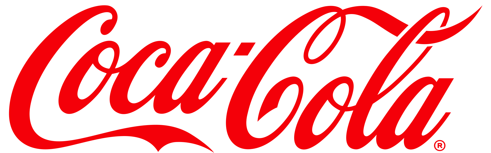
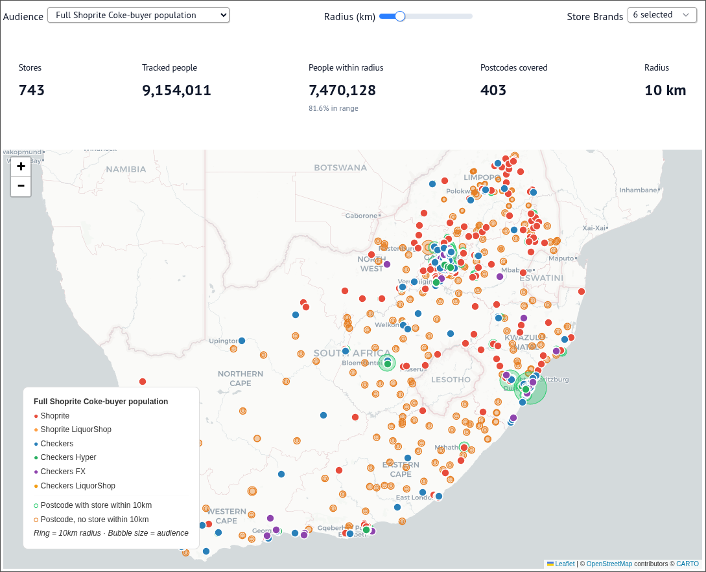

:: cover ::

<!--
Slide 1: Cover
Uses the custom web-native cover layout.
-->

---
layout: default
---

# What is Omnisient?

<div class="flex-1 flex flex-col justify-center">
<div class="stagger-in">

<div class="text-sm leading-relaxed">

Omnisient is an **award-winning, privacy-preserving data collaboration platform** that helps organisations generate new revenue, improve marketing performance, and manage risk by analysing data together **without ever sharing it**.

</div>

<div class="text-sm leading-relaxed mt-3">

Omnisient uses advanced cryptography and AI to enable cross-industry data ecosystems. Consumer data is anonymized and tokenized locally before upload. Matching happens in a secure, neutral cloud environment. Raw data never leaves the owner's control.

</div>

</div>
<div class="grid grid-cols-3 gap-3 mt-3 stagger-in">
  <div class="data-card text-center py-2 px-2">
    
    <div class="text-[9px] font-bold text-gray-800">Local Anonymization</div>
    <div class="text-[8px] text-gray-500 leading-snug">Crypto-IDs generated on your desktop. PII never leaves your firewall.</div>
  </div>
  <div class="data-card text-center py-2 px-2">
    
    <div class="text-[9px] font-bold text-gray-800">Secure Cloud Matching</div>
    <div class="text-[8px] text-gray-500 leading-snug">Anonymized IDs match mutual consumers across datasets in a neutral environment.</div>
  </div>
  <div class="data-card text-center py-2 px-2">
    
    <div class="text-[9px] font-bold text-gray-800">Built-in AI & Analytics</div>
    <div class="text-[8px] text-gray-500 leading-snug">Insights, models, and segments generated inside the environment. Only results come out.</div>
  </div>
</div>


<div class="grid grid-cols-4 gap-6 mt-4 text-center stagger-in">
  <div>
    <mdi-shield-check class="w-7 h-7 mx-auto mb-1 text-[#E61D2B]" />
    <div class="text-2xl font-extrabold text-[#E61D2B]">500M+</div>
    <div class="text-xs text-gray-500 mt-1">Consumer records protected</div>
  </div>
  <div>
    <mdi-earth class="w-7 h-7 mx-auto mb-1 text-[#E61D2B]" />
    <div class="text-2xl font-extrabold text-[#E61D2B]">100+</div>
    <div class="text-xs text-gray-500 mt-1">Enterprises globally</div>
  </div>
  <div>
    <mdi-timer-outline class="w-7 h-7 mx-auto mb-1 text-[#E61D2B]" />
    <div class="text-2xl font-extrabold text-[#E61D2B]">3 months</div>
    <div class="text-xs text-gray-500 mt-1">Average time to value post pilot</div>
  </div>
  <div>
    <mdi-certificate class="w-7 h-7 mx-auto mb-1 text-[#E61D2B]" />
    <div class="text-2xl font-extrabold text-[#E61D2B]">ISO 27001</div>
    <div class="text-xs text-gray-500 mt-1">Certified security</div>
  </div>
</div>

<div class="flex items-center justify-center gap-4 mt-2 opacity-60">
  
  
  
  
</div>
</div>

---
layout: default
---

# Commercial Opportunity: Driving Transactions

Linking Coca-Cola's 1PD directly to Shoprite/Checkers till-slip and transactional data to drive measurable growth.

<div class="grid grid-cols-3 gap-4 mt-4 stagger-in">
  <div class="data-card py-3 px-4 text-center">
    <mdi-cart-outline class="w-8 h-8 mx-auto mb-2 text-[#E61D2B]" />
    <div class="text-sm font-bold text-gray-900 mb-1">Frequency Growth</div>
    <p class="text-[9px] text-gray-600 leading-snug">Identify high-value shoppers who prefer Coca-Cola but only buy it occasionally. Target them with "stock-up" promotions to build a more frequent purchasing habit without discounting loyalists.</p>
  </div>
  <div class="data-card py-3 px-4 text-center">
    <mdi-crosshairs-gps class="w-8 h-8 mx-auto mb-2 text-[#E61D2B]" />
    <div class="text-sm font-bold text-gray-900 mb-1">Basket Cross-Selling</div>
    <p class="text-[9px] text-gray-600 leading-snug">Analyse exact basket compositions (e.g., buying meals but skipping beverages). Push targeted multi-brand bundles to close the gap and increase the total units per transaction.</p>
  </div>
  <div class="data-card py-3 px-4 text-center">
    <mdi-chart-bar class="w-8 h-8 mx-auto mb-2 text-[#E61D2B]" />
    <div class="text-sm font-bold text-gray-900 mb-1">Premium Trade-Up</div>
    <p class="text-[9px] text-gray-600 leading-snug">Use verified affluence indicators (STRiVE) to identify high-spending households capable of supporting premium price points. Push the premium portfolio exactly where it has the highest conversion probability.</p>
  </div>
</div>

<div class="grid grid-cols-1 mt-4 stagger-in">
  <div class="data-card py-2 px-4 text-center bg-gray-50 border-gray-200">
    <mdi-store-marker class="w-6 h-6 mx-auto mb-1 text-gray-600" />
    <div class="text-sm font-bold text-gray-900 mb-1">Route to Market: Informal Trade Catchments</div>
    <p class="text-[9px] text-gray-600 leading-snug">Use Shoprite/Checkers footprints as geographic anchors to identify high-density Coke-buying audiences in surrounding postcodes. Prioritise informal trade support (taverns, spazas) by proximity and verified shopper density.</p>
  </div>
</div>

<div class="data-card bg-red-50 border-red-100 mt-4 p-3 text-center text-sm">
  <strong class="text-[#E61D2B]">The shift:</strong> Moving from broad media targeting to precision transaction drivers—whether activating in-store via Xtra Savings, or digitally through <strong class="text-[#E61D2B]">Checkers Sixty60</strong>.
</div>

---
layout: default
---

# The Data Partnership

<div class="text-sm leading-relaxed stagger-in">

Coca-Cola and Shoprite/Checkers bring complementary datasets into the Omnisient clean room, creating a combined view that neither could achieve alone.
</div>

<div class="flex-1 flex flex-col justify-center min-w-0">
<div class="grid grid-cols-[1fr_auto_1fr] gap-4 w-full stagger-in">
  <div class="data-card py-3 px-4">
    <div class="flex items-center gap-2 mb-2">
      
      <span class="text-xs font-bold text-gray-800">Coca-Cola 1st Party Data</span>
    </div>
    <ul class="text-[10px] text-gray-600 leading-relaxed space-y-1 list-none pl-0">
      <li>✦ ~1.3M South African consumers</li>
      <li>✦ Contact details (email, phone)</li>
      <li>✦ Campaign interaction history</li>
      <li>✦ Questionnaire and preference data</li>
      <li>✦ Direct addressable via CRM</li>
    </ul>
  </div>
  <div class="flex items-center">
    <div class="data-card bg-red-50 border-red-200 py-4 px-3 text-center">
      <div class="text-lg font-extrabold text-[#E61D2B]">483K</div>
      <div class="text-[9px] text-gray-600 font-medium">Matched overlap</div>
    </div>
  </div>
  <div class="data-card py-3 px-4">
    <div class="flex items-center gap-2 mb-2">
      <mdi-cart-outline class="h-5 text-[#E61D2B]" />
      <span class="text-xs font-bold text-gray-800">Shoprite/Checkers Retail Data</span>
    </div>
    <ul class="text-[10px] text-gray-600 leading-relaxed space-y-1 list-none pl-0">
      <li>✦ ~15M transactional universe</li>
      <li>✦ SKU-level purchase history</li>
      <li>✦ Basket value, frequency, trends</li>
      <li>✦ Loyalty segments and spend propensity</li>
      <li>✦ Brand preference and category behaviour</li>
    </ul>
  </div>
</div>

<div class="text-center text-[10px] text-gray-500 mt-3">
  This creates three audiences: <strong>483K Direct</strong> (both databases), <strong>14.5M Indirect</strong> (Shoprite only, buying Coke products), and <strong>828K Coke-only</strong> (no purchase data in this clean room).
</div>
</div>

---
layout: default
---

# Data Available in the Clean Room

<div class="text-sm leading-relaxed stagger-in">
The matched dataset contains <strong>247 columns</strong> of consumer intelligence across multiple dimensions, refreshed across four time windows (13 weeks, 26 weeks, all-time, and previous period).
</div>

<div class="flex-1 flex items-center">
<div class="w-full">
<div class="grid grid-cols-3 gap-3 stagger-in">
  <div class="data-card py-2 px-3">
    <div class="flex items-center gap-2 mb-1">
      <mdi-account-group class="w-4 h-4 text-[#E61D2B]" />
      <span class="text-[10px] font-bold text-gray-800 uppercase tracking-wider">Demographics</span>
    </div>
    <ul class="text-[9px] text-gray-600 leading-snug space-y-0.5 list-none pl-0">
      <li>Age, gender, generation bucket</li>
      <li>Parental status and child count</li>
      <li>Pet ownership (cat, dog, other)</li>
      <li>Province and postal code</li>
    </ul>
  </div>
  <div class="data-card py-2 px-3">
    <div class="flex items-center gap-2 mb-1">
      <mdi-chart-bar class="w-4 h-4 text-[#E61D2B]" />
      <span class="text-[10px] font-bold text-gray-800 uppercase tracking-wider">Economic Profile</span>
    </div>
    <ul class="text-[9px] text-gray-600 leading-snug space-y-0.5 list-none pl-0">
      <li>CSHI decile band (1-10 affluence)</li>
      <li>Spend propensity (Super-Low to Super-High)</li>
      <li>Retail credit risk profile</li>
      <li>WINR segment (Winners to Rejectors)</li>
    </ul>
  </div>
  <div class="data-card py-2 px-3">
    <div class="flex items-center gap-2 mb-1">
      <mdi-cart-outline class="w-4 h-4 text-[#E61D2B]" />
      <span class="text-[10px] font-bold text-gray-800 uppercase tracking-wider">Purchase Behaviour</span>
    </div>
    <ul class="text-[9px] text-gray-600 leading-snug space-y-0.5 list-none pl-0">
      <li>Basket value, frequency, growth %</li>
      <li>Total units and value sales</li>
      <li>Customer tenure and recency</li>
      <li>Distinct brands/categories/products</li>
    </ul>
  </div>
</div>

<div class="grid grid-cols-3 gap-3 mt-2 stagger-in">
  <div class="data-card py-2 px-3">
    <div class="flex items-center gap-2 mb-1">
      <mdi-crosshairs-gps class="w-4 h-4 text-[#E61D2B]" />
      <span class="text-[10px] font-bold text-gray-800 uppercase tracking-wider">Brand Tracking</span>
    </div>
    <ul class="text-[9px] text-gray-600 leading-snug space-y-0.5 list-none pl-0">
      <li>16+ brand-level spend columns</li>
      <li>Purchase flags per brand per window</li>
      <li>Preferred brand identification</li>
      <li>Category spend (CSD, juice, water, energy)</li>
    </ul>
  </div>
  <div class="data-card py-2 px-3">
    <div class="flex items-center gap-2 mb-1">
      <mdi-database class="w-4 h-4 text-[#E61D2B]" />
      <span class="text-[10px] font-bold text-gray-800 uppercase tracking-wider">TCCC Brands Tracked</span>
    </div>
    <div class="text-[9px] text-gray-600 leading-snug">
      <span class="inline-block bg-gray-100 rounded px-1 py-0.5 mr-1 mb-0.5">Coca-Cola</span>
      <span class="inline-block bg-gray-100 rounded px-1 py-0.5 mr-1 mb-0.5">Fanta</span>
      <span class="inline-block bg-gray-100 rounded px-1 py-0.5 mr-1 mb-0.5">Sprite</span>
      <span class="inline-block bg-gray-100 rounded px-1 py-0.5 mr-1 mb-0.5">Bonaqua</span>
      <span class="inline-block bg-gray-100 rounded px-1 py-0.5 mr-1 mb-0.5">Powerade</span>
      <span class="inline-block bg-gray-100 rounded px-1 py-0.5 mr-1 mb-0.5">Stoney</span>
      <span class="inline-block bg-gray-100 rounded px-1 py-0.5 mr-1 mb-0.5">Cappy</span>
      <span class="inline-block bg-gray-100 rounded px-1 py-0.5 mr-1 mb-0.5">Schweppes</span>
      <span class="inline-block bg-gray-100 rounded px-1 py-0.5 mr-1 mb-0.5">Monster</span>
      <span class="inline-block bg-gray-100 rounded px-1 py-0.5 mr-1 mb-0.5">Valpré</span>
    </div>
  </div>
  <div class="data-card py-2 px-3">
    <div class="flex items-center gap-2 mb-1">
      <mdi-arrow-top-right class="w-4 h-4 text-[#E61D2B]" />
      <span class="text-[10px] font-bold text-gray-800 uppercase tracking-wider">Time Windows</span>
    </div>
    <ul class="text-[9px] text-gray-600 leading-snug space-y-0.5 list-none pl-0">
      <li><strong>13 weeks:</strong> Current quarter</li>
      <li><strong>Previous 13w:</strong> Prior quarter</li>
      <li><strong>26 weeks:</strong> Half-year view</li>
      <li><strong>All-time:</strong> Full purchase history</li>
    </ul>
  </div>
</div>
<div class="text-[9px] text-gray-400 italic text-center mt-3">
  * Note: This is only a high-level summary subset of the 247+ data points available per matched consumer.
</div>
</div>
</div>

---
layout: default
---

# The Coca-Cola Shopper Profile

<div class="text-sm leading-relaxed stagger-in">

Traditional commercial planning relies on market averages.

By matching Coca-Cola's own customer data with Shoprite's transactional records, we have a live snapshot of our shoppers: their basket sizes, their loyalty, and their **Sixy60 potential**.
</div>

<div class="grid grid-cols-[1fr_280px] gap-6 mt-4">
  <div class="grid grid-cols-1 gap-3 stagger-in">
    <div class="data-card flex items-center gap-3 py-2 px-4">
      <mdi-database class="w-6 h-6 flex-shrink-0 text-[#E61D2B]" />
      <div>
        <div class="text-lg font-extrabold text-[#E61D2B]">~1.3M</div>
        <div class="text-[10px] text-gray-500 leading-snug">Coca-Cola's first-party database of South African consumers collected through owned touchpoints.</div>
      </div>
    </div>
    <div class="data-card flex items-center gap-3 py-2 px-4">
      <mdi-cart-outline class="w-6 h-6 flex-shrink-0 text-[#E61D2B]" />
      <div>
        <div class="text-lg font-extrabold text-[#E61D2B]">~15M</div>
        <div class="text-[10px] text-gray-500 leading-snug">Shoprite's retail transactional universe, including purchase history, basket data, and spend behaviour.</div>
      </div>
    </div>
    <div class="data-card flex items-center gap-3 py-2 px-4 border-2 border-red-100 bg-red-50">
      <mdi-set-center class="w-6 h-6 flex-shrink-0 text-[#E61D2B]" />
      <div>
        <div class="text-lg font-extrabold text-[#E61D2B]">483K</div>
        <div class="text-[10px] text-gray-700 font-medium leading-snug">Consumers present in both databases. Our richest segment with both demographic profiles and purchase data.</div>
      </div>
    </div>
  </div>
  <div class="flex items-center justify-center">
    <AudienceDonut :height="240" />
  </div>
</div>

---
layout: two-cols-header
---

# Direct vs. Indirect: Two Audiences

<div class="leading-relaxed stagger-in">

The clean room reveals two distinct audience pools. Understanding the difference is the key to activation, each demands a different channel strategy.
</div>

:: left ::

<div class="stagger-in">


### Direct (Overlap)

<div class="text-xl font-extrabold text-[#E61D2B] my-2">483,225</div>

These consumers exist in Coca-Cola's 1st-party database AND are matched to Shoprite/Checkers purchase records. We know who they are and what they buy.

**The Data Layer:**
Demographic profiles from Coke, transaction history from Shoprite. These people are directly addressable.

<div class="mt-6 p-4 bg-gray-50 rounded-lg text-sm border border-gray-200">
  <strong>Activate via:</strong> Email, WhatsApp, App push, CRM retargeting, Paid Media (LAL)
</div>

</div>

:: right ::

<div class="stagger-in">


### Indirect (Shoprite Only)

<div class="text-xl font-extrabold text-[#E61D2B] my-2">14,550,394</div>

These consumers buy Coca-Cola products at Shoprite/Checkers but are NOT in Coke's 1st-party database. We can see their behaviour but can't reach them directly.

**The Scale Opportunity:**
30x larger than Direct. Real buyers with real transactions, just not yet in Coke's owned ecosystem.

<div class="mt-6 p-4 bg-gray-50 rounded-lg text-sm border border-gray-200">
  <strong>Activate via:</strong> Shoprite media network, Meta/Google lookalikes, retail media
</div>

</div>

<!-- Note: An additional 828,060 Coke 1PD records have no Shoprite match. -->

---
layout: default
---

# The 3-Party View: Adding STRiVE Data

<div class="text-xs leading-relaxed stagger-in">

While the core data partnership links Coke and Shoprite, we have also integrated **STRiVE data** (via the Department of Home Affairs) into the environment.

This introduces a **3-party data overlap**, bringing in a verified layer of socioeconomic and demographic context.
</div>

<div class="grid grid-cols-[1fr_280px] gap-6 mt-3">
  <div class="grid grid-cols-1 gap-2 stagger-in">
    <div class="data-card flex items-center gap-3 py-1.5 px-3">
      <mdi-database class="w-5 h-5 flex-shrink-0 text-[#E61D2B]" />
      <div>
        <div class="text-base font-extrabold text-[#E61D2B]">64.8M</div>
        <div class="text-[9px] text-gray-500 leading-snug">STRiVE universe: Verified South African demographic records, including age, geography, and socioeconomic flags.</div>
      </div>
    </div>
    <div class="data-card flex items-center gap-3 py-1.5 px-3">
      <mdi-set-center class="w-5 h-5 flex-shrink-0 text-[#E61D2B]" />
      <div>
        <div class="text-base font-extrabold text-[#E61D2B]">350,219</div>
        <div class="text-[9px] text-gray-500 leading-snug">The "Triple Overlap": Consumers present in Coke 1PD, Shoprite purchase data, AND STRiVE. The richest segment available.</div>
      </div>
    </div>
    <div class="data-card flex items-center gap-3 py-1.5 px-3 border-2 border-red-100 bg-red-50">
      <mdi-chart-bar class="w-5 h-5 flex-shrink-0 text-[#E61D2B]" />
      <div>
        <div class="text-xs font-bold text-gray-800">What STRiVE Adds</div>
        <div class="text-[9px] text-gray-700 font-medium leading-snug">
          <ul class="mb-0">
            <li><strong>Wealth Indicators:</strong> Property value, vehicle ownership, director/entrepreneur flags.</li>
            <li><strong>Verified Demographics:</strong> Marital status, verified SA citizenship, exact age validation.</li>
            <li><strong>Predictive Metrics:</strong> Salary predictions (4 groups) and Social Class segmentations.</li>
          </ul>
        </div>
      </div>
    </div>
  </div>
  <div class="flex flex-col justify-center text-center stagger-in">
    <div class="w-full aspect-square rounded-full border-[12px] border-gray-100 flex items-center justify-center relative">
      <!-- Abstract representation of the 3-way Venn diagram -->
      <div class="absolute w-24 h-24 rounded-full bg-[#E61D2B] opacity-50 -ml-8 -mt-8"></div>
      <div class="absolute w-24 h-24 rounded-full bg-[#2E7D32] opacity-50 ml-8 -mt-8"></div>
      <div class="absolute w-24 h-24 rounded-full bg-[#1976D2] opacity-50 mt-8"></div>
      <div class="absolute z-10 text-xs font-bold text-white tracking-widest drop-shadow-md">
        350K<br/>MATCH
      </div>
    </div>
    <div class="mt-4 text-xs text-gray-500 leading-tight">
      STRiVE turns inferred demographics into <strong>verified socioeconomic facts</strong>.
    </div>
  </div>
</div>

---
layout: default
---

# The Coca-Cola Shopper: Verified by STRiVE

<div class="text-sm leading-relaxed stagger-in">

Before the STRiVE data integration, the composition of Coca-Cola's 1st-party database was largely inferred. The assumption was that competition entrants skewed young and lower-income. 

**The STRiVE 3-party overlap proves the opposite:** The Coca-Cola CRM base significantly over-indexes on wealth, stability, and asset ownership compared to the national average. It is a highly premium audience.
</div>

<div class="grid grid-cols-3 gap-4 mt-4 stagger-in">
  <div class="data-card py-3 px-4">
    <div class="flex items-center gap-2 mb-2">
      <mdi-trending-up class="h-5 text-[#E61D2B]" />
      <span class="text-xs font-bold text-gray-800">Wealth & Assets</span>
    </div>
    <ul class="text-[10px] text-gray-600 leading-relaxed space-y-1 list-none pl-0">
      <li>✦ Highly over-indexed on <strong>Home Ownership</strong></li>
      <li>✦ Higher-than-average <strong>Property Values</strong></li>
      <li>✦ Highly over-indexed on <strong>Vehicle Ownership</strong></li>
      <li>✦ Skews toward higher salary bands</li>
    </ul>
  </div>
  <div class="data-card py-3 px-4">
    <div class="flex items-center gap-2 mb-2">
      <mdi-account-group class="h-5 text-[#E61D2B]" />
      <span class="text-xs font-bold text-gray-800">Established Families</span>
    </div>
    <ul class="text-[10px] text-gray-600 leading-relaxed space-y-1 list-none pl-0">
      <li>✦ Significantly over-indexed on being <strong>Parents</strong></li>
      <li>✦ Higher index of <strong>Married</strong> individuals</li>
      <li>✦ Over-represented by <strong>Females</strong></li>
      <li>✦ Indicates significantly higher consumption potential per household</li>
    </ul>
  </div>
  <div class="data-card py-3 px-4">
    <div class="flex items-center gap-2 mb-2">
      <mdi-briefcase class="h-5 text-[#E61D2B]" />
      <span class="text-xs font-bold text-gray-800">Professional Status</span>
    </div>
    <ul class="text-[10px] text-gray-600 leading-relaxed space-y-1 list-none pl-0">
      <li>✦ Strong over-index on <strong>Company Directors</strong></li>
      <li>✦ 30-49 year-olds heavily represented</li>
      <li>✦ Gauteng & Limpopo over-represented</li>
      <li>✦ Salary frequency data available (e.g. end-of-month vs weekly)</li>
    </ul>
  </div>
</div>

<div class="data-card bg-red-50 border-red-100 mt-4 p-3 text-center text-sm font-medium text-gray-900 stagger-in">
  <span class="text-[#E61D2B] font-bold">The Commercial "So What":</span><br/>
  This is not a budget-constrained audience. They are affluent, asset-owning families primed for <strong>Checkers Sixty60 adoption</strong>, <strong>premium portfolio trade-ups</strong>, and <strong>high-value basket growth</strong>.
</div>

---
layout: two-cols-header
---

# Shopper Deep Dive: Demographics

The 1st-party database attracts consumers across all age bands, but significantly over-indexes on the critical 30-49 demographic vs. the national STRiVE average.

:: left ::

<div class="stagger-in">

### Age Distribution

<div class="mt-4 data-card bg-white p-4 text-xs">
  <table class="w-full text-left">
    <thead>
      <tr class="border-b border-gray-200 text-[10px] text-gray-500 uppercase tracking-wider">
        <th class="pb-2 font-bold">Age Band</th>
        <th class="pb-2 font-bold text-center">Shoprite Baseline</th>
        <th class="pb-2 font-bold text-center text-[#E61D2B]">Coca-Cola CRM</th>
      </tr>
    </thead>
    <tbody>
      <tr class="border-b border-gray-100">
        <td class="py-2 font-medium">18-24</td>
        <td class="py-2 text-center text-gray-500">18%</td>
        <td class="py-2 text-center font-bold text-[#E61D2B]">15%</td>
      </tr>
      <tr class="border-b border-gray-100">
        <td class="py-2 font-medium">25-29</td>
        <td class="py-2 text-center text-gray-500">25%</td>
        <td class="py-2 text-center font-bold text-[#E61D2B]">22%</td>
      </tr>
      <tr class="border-b border-gray-100 bg-red-50">
        <td class="py-2 font-extrabold text-gray-900 pl-2">30-39</td>
        <td class="py-2 text-center text-gray-500">25%</td>
        <td class="py-2 text-center font-extrabold text-[#E61D2B]">35%</td>
      </tr>
      <tr class="border-b border-gray-100 bg-red-50">
        <td class="py-2 font-extrabold text-gray-900 pl-2">40-49</td>
        <td class="py-2 text-center text-gray-500">22%</td>
        <td class="py-2 text-center font-extrabold text-[#E61D2B]">25%</td>
      </tr>
      <tr>
        <td class="py-2 font-medium">50+</td>
        <td class="py-2 text-center text-gray-500">10%</td>
        <td class="py-2 text-center font-bold text-[#E61D2B]">8%</td>
      </tr>
    </tbody>
  </table>
  <div class="mt-3 text-[10px] text-gray-500 leading-snug italic">
    The Coca-Cola base heavily over-indexes in the highest-earning, family-forming 30-49 brackets compared to the Shoprite norm.
  </div>
</div>

</div>

:: right ::

<div class="stagger-in">

### Gender & Life Stage

<div class="mt-4 data-card bg-white p-4 text-xs">
  <table class="w-full text-left">
    <thead>
      <tr class="border-b border-gray-200 text-[10px] text-gray-500 uppercase tracking-wider">
        <th class="pb-2 font-bold">Category</th>
        <th class="pb-2 font-bold text-center">Shoprite Baseline</th>
        <th class="pb-2 font-bold text-center text-[#E61D2B]">Coca-Cola CRM</th>
      </tr>
    </thead>
    <tbody>
      <tr class="border-b border-gray-100">
        <td class="py-2 font-medium">Female</td>
        <td class="py-2 text-center text-gray-500">53%</td>
        <td class="py-2 text-center font-bold text-[#E61D2B]">61%</td>
      </tr>
      <tr class="border-b border-gray-100">
        <td class="py-2 font-medium">Married</td>
        <td class="py-2 text-center text-gray-500">28%</td>
        <td class="py-2 text-center font-bold text-[#E61D2B]">42%</td>
      </tr>
      <tr>
        <td class="py-2 font-medium">Parent</td>
        <td class="py-2 text-center text-gray-500">45%</td>
        <td class="py-2 text-center font-bold text-[#E61D2B]">58%</td>
      </tr>
    </tbody>
  </table>
  <div class="mt-3 text-[10px] text-gray-500 leading-snug italic">
    The Coca-Cola base heavily over-indexes on key household markers: females, married couples, and parents.
  </div>
</div>

<div class="grid grid-cols-1 gap-3 mt-4">
  <div class="data-card py-2 px-4 flex items-center gap-3">
    <mdi-map-marker class="w-6 h-6 flex-shrink-0 text-[#E61D2B]" />
    <div>
      <div class="text-xs font-bold text-gray-900">Gauteng & Limpopo Concentration</div>
      <div class="text-[9px] text-gray-500 leading-snug">These two provinces are slightly over-represented relative to the national average.</div>
    </div>
  </div>
</div>

</div>

---
layout: two-cols-header
---

# Shopper Deep Dive: Wealth & Lifestyle

The most remarkable finding: TCCC's ability to attract high-affluence populations to its Direct Customer initiative has been highly successful across all brackets.

:: left ::

<div class="stagger-in">

### Asset Ownership (Vs National Avg)

<div class="grid grid-cols-2 gap-3 mt-4">
  <div class="data-card p-4 text-center border-t-4 border-t-[#E61D2B]">
    <mdi-home class="w-6 h-6 mx-auto mb-2 text-[#E61D2B]" />
    <div class="text-[10px] font-bold text-gray-500 uppercase tracking-widest">Homeowner</div>
    <div class="text-lg font-extrabold text-gray-900 mt-1">Over-Index</div>
  </div>
  <div class="data-card p-4 text-center border-t-4 border-t-[#E61D2B]">
    <mdi-car class="w-6 h-6 mx-auto mb-2 text-[#E61D2B]" />
    <div class="text-[10px] font-bold text-gray-500 uppercase tracking-widest">Vehicle Owner</div>
    <div class="text-lg font-extrabold text-gray-900 mt-1">Over-Index</div>
  </div>
  <div class="data-card p-4 text-center border-t-4 border-t-[#E61D2B]">
    <mdi-home-city class="w-6 h-6 mx-auto mb-2 text-[#E61D2B]" />
    <div class="text-[10px] font-bold text-gray-500 uppercase tracking-widest">Property Value</div>
    <div class="text-lg font-extrabold text-gray-900 mt-1">Above Avg</div>
  </div>
  <div class="data-card p-4 text-center border-t-4 border-t-[#E61D2B]">
    <mdi-human-male-female-child class="w-6 h-6 mx-auto mb-2 text-[#E61D2B]" />
    <div class="text-[10px] font-bold text-gray-500 uppercase tracking-widest">Parent</div>
    <div class="text-lg font-extrabold text-gray-900 mt-1">High Index</div>
  </div>
</div>

<div class="text-[10px] text-gray-500 mt-3 leading-snug italic">
  This proves the 1st-party database isn't just "young competition entrants" but established, asset-owning families.
</div>

</div>

:: right ::

<div class="stagger-in">

### Income Representation

<div class="mt-4 data-card bg-white p-4 text-xs">
  <table class="w-full text-left">
    <thead>
      <tr class="border-b border-gray-200 text-[10px] text-gray-500 uppercase tracking-wider">
        <th class="pb-2 font-bold">Social Class</th>
        <th class="pb-2 font-bold text-center">Shoprite Baseline</th>
        <th class="pb-2 font-bold text-center text-[#E61D2B]">Coca-Cola CRM</th>
      </tr>
    </thead>
    <tbody>
      <tr class="border-b border-gray-100">
        <td class="py-2 font-medium">Lower Class</td>
        <td class="py-2 text-center text-gray-500">35%</td>
        <td class="py-2 text-center font-bold text-[#E61D2B]">10%</td>
      </tr>
      <tr class="border-b border-gray-100">
        <td class="py-2 font-medium">Working Class</td>
        <td class="py-2 text-center text-gray-500">40%</td>
        <td class="py-2 text-center font-bold text-[#E61D2B]">20%</td>
      </tr>
      <tr class="border-b border-gray-100 bg-red-50">
        <td class="py-2 font-extrabold text-gray-900 pl-2">Middle Class</td>
        <td class="py-2 text-center text-gray-500">15%</td>
        <td class="py-2 text-center font-extrabold text-[#E61D2B]">45%</td>
      </tr>
      <tr class="bg-red-50">
        <td class="py-2 font-extrabold text-gray-900 pl-2 rounded-bl">Affluent / Wealthy</td>
        <td class="py-2 text-center text-gray-500">10%</td>
        <td class="py-2 text-center font-extrabold text-[#E61D2B] rounded-br">25%</td>
      </tr>
    </tbody>
  </table>
  <div class="mt-3 text-[10px] text-gray-500 leading-snug italic">
    The most dramatic shift: Coca-Cola's CRM audience is vastly more affluent than the average Shoprite shopper.
  </div>
</div>

</div>

---
layout: two-cols-header
---

# Shopper Deep Dive: Career & Pay Cycles

TCCC heavily over-indexes on Company Directors and White Collar workers, fundamentally altering when and how commercial offers should be deployed.

:: left ::

<div class="stagger-in">

### Month-End Targeting Opportunity

<div class="mt-4 data-card bg-white p-4 h-[240px] flex flex-col justify-center gap-4">
  <div>
    <div class="flex justify-between text-[10px] font-bold mb-1">
      <span class="text-gray-700">White Collar (Month-End) - Coca-Cola CRM</span>
      <span class="text-[#E61D2B]">41%</span>
    </div>
    <div class="w-full bg-gray-200 rounded-full h-2">
      <div class="bg-[#E61D2B] h-2 rounded-full" style="width: 41%"></div>
    </div>
  </div>
  
  <div>
    <div class="flex justify-between text-[10px] font-bold mb-1">
      <span class="text-gray-500">White Collar (Month-End) - Shoprite Baseline</span>
      <span class="text-gray-500">22%</span>
    </div>
    <div class="w-full bg-gray-100 rounded-full h-2">
      <div class="bg-gray-400 h-2 rounded-full" style="width: 22%"></div>
    </div>
  </div>
</div>

<div class="data-card p-3 mt-3 text-center bg-gray-50">
  <h3 class="text-xs font-bold text-gray-900 mb-1">The Commercial Implication</h3>
  <p class="text-[10px] text-gray-600 leading-snug">
    Because the CRM base heavily favours white-collar professionals, premium trade-up campaigns and high-value Checkers Sixty60 bundles will perform best when timed explicitly around <strong>month-end pay days</strong>.
  </p>
</div>

</div>

:: right ::

<div class="stagger-in">

### Pay Frequency Distribution

<div class="mt-4 data-card bg-white p-4 text-xs">
  <table class="w-full text-left">
    <thead>
      <tr class="border-b border-gray-200 text-[10px] text-gray-500 uppercase tracking-wider">
        <th class="pb-2 font-bold">Pay Type</th>
        <th class="pb-2 font-bold text-center">Shoprite Baseline</th>
        <th class="pb-2 font-bold text-center text-[#E61D2B]">Coca-Cola CRM</th>
      </tr>
    </thead>
    <tbody>
      <tr class="border-b border-gray-100 bg-red-50">
        <td class="py-2 font-extrabold text-gray-900 pl-2">White Collar (Month-end)</td>
        <td class="py-2 text-center text-gray-500">22%</td>
        <td class="py-2 text-center font-extrabold text-[#E61D2B]">41%</td>
      </tr>
      <tr class="border-b border-gray-100">
        <td class="py-2 font-medium pl-2">Blue Collar (Weekly)</td>
        <td class="py-2 text-center text-gray-500">55%</td>
        <td class="py-2 text-center font-bold text-[#E61D2B]">38%</td>
      </tr>
      <tr>
        <td class="py-2 font-medium pl-2">Civil Servant (Mid-month)</td>
        <td class="py-2 text-center text-gray-500">18%</td>
        <td class="py-2 text-center font-bold text-[#E61D2B]">15%</td>
      </tr>
    </tbody>
  </table>
  <div class="mt-3 text-[10px] text-gray-500 leading-snug italic">
    The national average skews heavily toward weekly-paid blue collar workers (55%), but the Coca-Cola CRM base reverses this trend entirely, dominated by month-end salaried professionals (41%).
  </div>
</div>

</div>

---
layout: default
---

<div class="text-sm font-bold uppercase tracking-widest text-gray-400 mb-2">SCENARIO A</div>

# Occasional Buyer: The Frequency Opportunity

<div class="stagger-in">

<div class="text-sm font-medium text-[#E61D2B] mb-2">
  Goal: Increase purchase frequency among high-spend households
</div>

<div class="text-sm leading-relaxed">
Driving volume doesn't always mean finding new customers; it often means getting existing buyers to purchase more often. A blanket frequency promotion wastes margin on those who already buy weekly.
</div>

<div class="text-sm leading-relaxed mt-3">
  Using the clean room, we can identify high-value households (High/Super-High spend propensity) who prefer Coca-Cola, but are only purchasing our products **less than once a week**. We can deliver targeted "multi-buy" or "stock up" incentives specifically to this low-frequency cohort.
</div>

</div>

<div class="grid grid-cols-[1fr_auto] gap-4 mt-4">
  <div class="data-card bg-red-50 border-red-100 p-3 text-center text-sm font-medium text-gray-900 flex flex-col justify-center stagger-in">
    <mdi-chart-bar class="w-6 h-6 mx-auto mb-2 text-[#E61D2B]" />
    <span class="text-[#E61D2B] font-bold">Identify the volume gap in loyal households, push a "stock up" promotion, and measure the incremental frequency lift directly.</span>
  </div>
</div>

---
layout: default
---

# Scenario A: "High-Value Occasional Buyers"

<div class="stagger-in">

We narrow the 15M Shoprite universe down to a tightly defined audience: **Households with high overall spend, who prefer Coca-Cola, but buy our products infrequently.**

</div>

<div class="grid grid-cols-2 gap-4 mt-4 stagger-in">
<div>

### Segment Filters

- <mdi-cart-outline class="inline w-4 h-4 mr-1 -mt-0.5 text-[#E61D2B]" /> **Total Grocery Spend:** High or Super-High spend propensity
- <mdi-crosshairs-gps class="inline w-4 h-4 mr-1 -mt-0.5 text-[#E61D2B]" /> **Brand loyalty:** Preferred brand is Coca-Cola
- <mdi-chart-bar class="inline w-4 h-4 mr-1 -mt-0.5 text-[#E61D2B]" /> **Frequency:** Less than 1 basket per week over 13 weeks

<div class="mt-4 data-card bg-gray-50 py-2 text-center">
<div class="text-[9px] text-gray-500 uppercase tracking-wider mb-1">Target Segment (High Value / Low Freq)</div>
<div class="text-lg font-extrabold text-[#E61D2B]">1,113,615</div>
<div class="text-[9px] text-gray-500 italic mt-1">(Confirmed via Live SQL)</div>
</div>

</div>
<div>


### Commercial Activation

We deliver a **"Stock Up & Save" volume offer (e.g. Buy 3, Pay for 2)** via Checkers Xtra Savings or digital channels. This is explicitly hidden from the 1.5M Coke loyalists who already buy multiple times a week.

*   **Goal:** Move occasional buyers to weekly buyers.
*   **Metric:** Delta in `avg_baskets_per_week_13w` post-campaign.

</div>
</div>

---
layout: two-cols-header
---

<div class="text-sm font-bold uppercase tracking-widest text-gray-400 mb-2">SCENARIO B</div>

# Portfolio Cross-Selling (Basket Growth)

<div class="text-xs leading-relaxed">
  Cross-selling is hard when you don't know what a shopper <em>already</em> buys. The clean room lets us query exact basket compositions. We found <strong>180K</strong> high-value shoppers who buy Coke with large grocery baskets (R500+), but skipped purchasing Fanta last quarter.
</div>

:: left ::

<div class="stagger-in">

### Audience Split

<div class="data-card bg-gray-50 border-gray-200 text-center py-2 mb-3 flex items-center justify-center gap-4">
  <div class="text-2xl font-extrabold text-gray-800">180,616</div>
  <div class="text-[10px] font-bold text-gray-600">Target Shoppers</div>
</div>

<div class="flex justify-center items-end gap-6 h-[110px] mb-3">
  <div class="flex flex-col items-center">
    <div class="text-[10px] font-bold text-[#E61D2B] mb-1">6,769</div>
    <div class="w-16 bg-[#E61D2B] rounded-t" style="height: 12px;"></div>
    <div class="text-[8px] text-gray-500 mt-1 text-center leading-tight">Direct (CRM)</div>
  </div>
  <div class="flex flex-col items-center">
    <div class="text-[10px] font-bold text-[#2E7D32] mb-1">173,847</div>
    <div class="w-16 bg-[#2E7D32] rounded-t" style="height: 85px;"></div>
    <div class="text-[8px] text-gray-500 mt-1 text-center leading-tight">Indirect (Retail Media)</div>
  </div>
</div>

<div class="grid grid-cols-2 gap-2">
  <div class="p-2 bg-gray-50 rounded text-center border border-gray-200">
    <mdi-bullhorn class="w-4 h-4 mx-auto mb-1 text-[#E61D2B]" />
    <div class="text-[9px] font-bold text-gray-700">Direct Channel</div>
    <div class="text-[8px] text-gray-500 leading-snug">SMS / WhatsApp combo deal in-store or near Sixty60 catchment</div>
  </div>
  <div class="p-2 bg-gray-50 rounded text-center border border-gray-200">
    <mdi-bullhorn class="w-4 h-4 mx-auto mb-1 text-[#2E7D32]" />
    <div class="text-[9px] font-bold text-gray-700">Indirect Channel</div>
    <div class="text-[8px] text-gray-500 leading-snug">Sixty60 "Add to Basket" prompt on meal components</div>
  </div>
</div>

</div>

:: right ::

<div class="stagger-in">

### Segment Spend Profile

<div class="mt-2 data-card bg-white p-3 text-xs">
  <table class="w-full text-left">
    <thead>
      <tr class="border-b border-gray-200 text-[10px] text-gray-500 uppercase tracking-wider">
        <th class="pb-2 font-bold">Metric</th>
        <th class="pb-2 font-bold text-center text-[#E61D2B]">Direct</th>
        <th class="pb-2 font-bold text-center text-[#2E7D32]">Indirect</th>
      </tr>
    </thead>
    <tbody>
      <tr class="border-b border-gray-100">
        <td class="py-1.5 font-medium"><mdi-cart-outline class="inline w-3 h-3 mr-1 text-gray-400" />Avg Basket (13w)</td>
        <td class="py-1.5 text-center font-bold">R542</td>
        <td class="py-1.5 text-center font-bold">R510</td>
      </tr>
      <tr class="border-b border-gray-100">
        <td class="py-1.5 font-medium"><mdi-cash class="inline w-3 h-3 mr-1 text-gray-400" />Avg Coke Spend (13w)</td>
        <td class="py-1.5 text-center font-bold">R89</td>
        <td class="py-1.5 text-center font-bold">R74</td>
      </tr>
      <tr class="border-b border-gray-100">
        <td class="py-1.5 font-medium"><mdi-basket class="inline w-3 h-3 mr-1 text-gray-400" />Avg Baskets/Week</td>
        <td class="py-1.5 text-center font-bold">1.8</td>
        <td class="py-1.5 text-center font-bold">1.5</td>
      </tr>
      <tr class="border-b border-gray-100">
        <td class="py-1.5 font-medium"><mdi-bottle-soda class="inline w-3 h-3 mr-1 text-gray-400" />Buys Coca-Cola</td>
        <td class="py-1.5 text-center font-bold text-[#E61D2B]">✓</td>
        <td class="py-1.5 text-center font-bold text-[#2E7D32]">✓</td>
      </tr>
      <tr>
        <td class="py-1.5 font-medium"><mdi-bottle-soda-outline class="inline w-3 h-3 mr-1 text-gray-400" />Buys Fanta</td>
        <td class="py-1.5 text-center font-bold text-red-400">✗</td>
        <td class="py-1.5 text-center font-bold text-red-400">✗</td>
      </tr>
    </tbody>
  </table>
</div>

<div class="mt-3 data-card bg-red-50 border-red-100 p-2 text-center">
  <div class="text-[10px] font-bold text-[#E61D2B] mb-1">The Cross-Sell Gap</div>
  <div class="text-[9px] text-gray-700 leading-snug">
    These shoppers spend R500+ per basket and buy Coca-Cola every week, but have <strong>never purchased Fanta</strong>. A targeted "Coke + Fanta" combo offer closes this gap and lifts units per basket.
  </div>
</div>

</div>

---
layout: default
---

<div class="text-sm font-bold uppercase tracking-widest text-gray-400 mb-2">SCENARIO C</div>

# Premium Portfolio: The Affluence Opportunity

<div class="text-sm font-medium text-[#E61D2B] mb-2">
  Goal: Drive premium SKUs (e.g. Appletiser, Valpre, Schweppes) to high-spending households
</div>

<div class="grid grid-cols-[1fr_180px] gap-6 stagger-in">
<div class="stagger-in">

<div class="text-sm leading-relaxed">
To drive volume on the premium portfolio, we need to target households with the disposable income to support higher price points, without wasting promotional spend on highly price-sensitive shoppers.
</div>

<div class="text-sm leading-relaxed mt-3">
  The clean room allows us to use Shoprite's CSHI (Consumer Socio-economic Health Index) decile bands and spend propensity data as a robust proxy for affluence, rather than relying on assumed demographics.
</div>

<div class="my-3 p-3 bg-gray-50 border border-gray-200 rounded-lg text-sm">
  This allows us to deploy targeted, high-value premium promotions exclusively to the households that can actually afford to convert and repeat purchase.
</div>

</div>
<div class="flex items-start justify-center stagger-in">


</div>

<div class="data-card bg-red-50 border-red-100 mt-4 p-3 text-center text-sm font-medium text-gray-900">
  We don't guess who is affluent. <br/>
  <span class="text-[#E61D2B] font-bold">CSHI decile 8-10 combined with High/Super-High spend propensity gives us a data-proven affluence signal for precision promotion.</span>
</div>
</div>


---
layout: two-cols-header
---

# Premium Segment: The Affluent Buyer

We identify affluent, mature consumers with high spending power, the ideal audience for premium brand trials.

:: left ::

<div class="stagger-in">

### Segment Filters

<ul class="space-y-4 mt-4">
  <li class="flex items-start"><span class="text-[#E61D2B] mr-2">✓</span> <strong>Age range:</strong> 30 to 59 years old</li>
  <li class="flex items-start"><span class="text-[#E61D2B] mr-2">✓</span> <strong>Affluence proxy:</strong> CSHI decile 8 (Good-), 9 (Good), 10 (Good+)</li>
  <li class="flex items-start"><span class="text-[#E61D2B] mr-2">✓</span> <strong>Spend propensity:</strong> High or Super-High</li>
</ul>

<div class="mt-3 data-card bg-gray-50 py-2 text-center border border-gray-200">
  <div class="text-[9px] text-gray-500 uppercase tracking-wider mb-1">Total Affluent Consumers in Segment</div>
  <div class="text-xl font-extrabold text-[#E61D2B]">659,856</div>
  <div class="text-[9px] text-gray-500 italic mt-1">(Confirmed via 3-Party SQL)</div>
</div>

<div class="mt-3 text-[10px] text-gray-400 italic">
  Note: CSHI + spend_propensity used as affluence proxy.
</div>

</div>

:: right ::

<div class="stagger-in">


### Spend Profile

<div class="grid grid-cols-2 gap-3 mt-4">
  <div class="p-3 border border-gray-200 rounded text-center">
    <div class="text-base font-bold text-[#E61D2B]">R313</div>
    <div class="text-[10px] text-gray-500">Avg grocery spend (Direct, 13w)</div>
  </div>
  <div class="p-3 border border-gray-200 rounded text-center">
    <div class="text-base font-bold text-[#E61D2B]">R262</div>
    <div class="text-[10px] text-gray-500">Avg grocery spend (Indirect, 13w)</div>
  </div>
  <div class="p-3 border border-gray-200 rounded text-center">
    <div class="text-base font-bold text-gray-700">R52</div>
    <div class="text-[10px] text-gray-500">Avg basket value (Direct)</div>
  </div>
  <div class="p-3 border border-gray-200 rounded text-center">
    <div class="text-base font-bold text-gray-700">R50</div>
    <div class="text-[10px] text-gray-500">Avg basket value (Indirect)</div>
  </div>
</div>

<div class="mt-4 text-xs text-gray-600 leading-snug">
  <strong class="text-[#E61D2B]">High-Value Cohort:</strong> The Direct overlap segment significantly outspends the Indirect average. These are our primary targets for premium trade-up offers via Checkers Sixty60.
</div>

</div>

---
layout: two-cols-header
---

# Premium Activation: The Spend Insight

<div class="grid grid-cols-[1fr_180px] gap-4 mb-2 stagger-in">
  <div>
    <div class="data-card bg-gray-50 border-gray-200 text-center py-2 mb-2">
      <div class="text-2xl font-extrabold text-gray-800">659,856</div>
      <div class="text-xs font-bold text-gray-600">Total Affluent Segment</div>
    </div>
    <div class="text-sm leading-relaxed">The Direct overlap consumers outspend Indirect significantly. These are the highest-value, most addressable people in the segment and the perfect seed for targeted premium promotions.</div>
  </div>
  <div class="flex items-center justify-center">
    <SplitDonut :directValue="18408" :indirectValue="641448" directColor="#E61D2B" indirectColor="#2E7D32" :height="170" />
  </div>
</div>

:: left ::

<div class="stagger-in">

### Direct (Coke 1PD + Shoprite + STRiVE)

<div class="text-2xl font-extrabold text-[#E61D2B] my-2">18,408</div>
<div class="text-xs font-bold text-gray-500 mb-2">2.8% of segment</div>

Affluent consumers that Coca-Cola already knows. Their higher basket value and total spend makes them the most valuable segment.

<div class="mt-3 p-3 bg-gray-50 rounded-lg text-xs border border-gray-200">
  <mdi-bullhorn class="inline w-4 h-4 mr-1 -mt-0.5 text-[#E61D2B]" />
  <strong>Activate:</strong> Targeted digital promos, App notifications, CRM
</div>

</div>

:: right ::

<div class="stagger-in">

### Indirect (Shoprite + STRiVE)

<div class="text-2xl font-extrabold text-[#2E7D32] my-2">641,448</div>
<div class="text-xs font-bold text-gray-500 mb-2">97.2% of segment</div>

The scale play. These affluent consumers shop at Shoprite/Checkers and have the disposable income for premium SKUs, but aren't in Coke's CRM.

<div class="mt-3 p-3 bg-gray-50 rounded-lg text-xs border border-gray-200">
  <mdi-bullhorn class="inline w-4 h-4 mr-1 -mt-0.5 text-[#2E7D32]" />
  <strong>Activate:</strong> Shoprite retail media, premium shelf placement, Meta/Google lookalikes
</div>

</div>

---
layout: two-cols-header
---

<div class="text-sm font-bold uppercase tracking-widest text-gray-400 mb-2">SCENARIO D</div>

# Route to Market: Informal Trade Catchments

<div class="text-sm font-medium text-[#E61D2B] mb-4 stagger-in">
  Goal: Identify high-density Coke shopper catchments to support informal trade and spaza ecosystems.
</div>

:: left ::

<div class="stagger-in pr-4">

<div class="text-xs leading-relaxed mb-3">
Not all growth happens through formal retail. By using the locations of the <strong>~1,191 Shoprite and Checkers stores</strong> as geographic anchors, we can map the exact postcodes where matched Coke shoppers live.
</div>

<div class="text-xs leading-relaxed mb-4">
Rather than guessing where to deploy trade marketing resources, this allows us to prioritise which local taverns, spaza ecosystems, and informal resellers to support with hyperlocal trade messaging based on verified shopper density.
</div>

<div class="grid grid-cols-2 gap-2">
  <div class="data-card p-3">
    <div class="text-[9px] font-bold text-gray-500 uppercase tracking-widest mb-1">Scale Play</div>
    <div class="text-lg font-extrabold text-[#E61D2B]">348K</div>
    <div class="text-[10px] text-gray-700 font-medium leading-tight">Mapped Coke + Shoprite</div>
    <div class="text-[8px] text-gray-500 mt-1">Across 609 postcodes.</div>
  </div>
  <div class="data-card p-3">
    <div class="text-[9px] font-bold text-gray-500 uppercase tracking-widest mb-1">Precision Play</div>
    <div class="text-lg font-extrabold text-[#E61D2B]">255K</div>
    <div class="text-[10px] text-gray-700 font-medium leading-tight">Mapped + STRiVE Verified</div>
    <div class="text-[8px] text-gray-500 mt-1">Across 607 postcodes.</div>
  </div>
</div>

</div>

:: right ::

<div class="stagger-in pl-2">
  <div class="flex justify-center items-center bg-gray-50 rounded-lg shadow-sm border border-gray-200 p-1 mb-3" style="height: 250px;">
    
  </div>
  
  <div class="data-card bg-red-50 border-red-100 p-2 text-left flex items-start gap-2">
    <mdi-map-marker-radius class="w-5 h-5 text-[#E61D2B] mt-0.5 flex-shrink-0" />
    <div>
      <span class="text-[10px] text-[#E61D2B] font-bold">The Geolocation Advantage</span><br/>
      <span class="text-[9px] text-gray-700 leading-tight block mt-0.5">Using walk-time and short-drive isochrones around retail nodes to surgically target the informal sector.</span>
    </div>
  </div>
</div>

---
layout: default
---

# Commercial Summary: Actionable Segments

<div class="stagger-in">
The data partnership provides actionable segments for immediate commercial growth across acquisition, basket-building, and premium trade-up.

<table class="mt-4 text-sm stagger-in w-full text-left">
  <thead>
    <tr class="border-b border-gray-200">
      <th class="pb-2"></th>
      <th class="pb-2 font-bold text-gray-900">Scenario</th>
      <th class="pb-2 font-bold text-gray-900">Segment Size</th>
      <th class="pb-2 font-bold text-gray-900">Commercial Objective</th>
    </tr>
  </thead>
  <tbody>
    <tr class="border-b border-gray-100">
      <td class="py-3"><mdi-cart-outline class="w-5 h-5 text-[#E61D2B]" /></td>
      <td class="py-3 font-bold text-gray-900">Frequency Growth</td>
      <td class="py-3 font-bold text-[#E61D2B] text-base">1.1M</td>
      <td class="py-3 text-sm text-gray-700">Increase purchase frequency of occasional, high-spend households</td>
    </tr>
    <tr class="border-b border-gray-100">
      <td class="py-3"><mdi-crosshairs-gps class="w-5 h-5 text-[#E61D2B]" /></td>
      <td class="py-3 font-bold text-gray-900">Basket Cross-Selling</td>
      <td class="py-3 font-bold text-[#E61D2B] text-base">180K</td>
      <td class="py-3 text-sm text-gray-700">Increase unit volume per basket via combo incentives</td>
    </tr>
    <tr>
      <td class="py-3"><mdi-chart-bar class="w-5 h-5 text-[#E61D2B]" /></td>
      <td class="py-3 font-bold text-gray-900">Premium Trade-Up</td>
      <td class="py-3 font-bold text-[#E61D2B] text-base">660K</td>
      <td class="py-3 text-sm text-gray-700">Target proven affluent households with premium SKUs</td>
    </tr>
    <tr class="border-t border-gray-100">
      <td class="py-3"><mdi-store-marker class="w-5 h-5 text-[#E61D2B]" /></td>
      <td class="py-3 font-bold text-gray-900">Informal Trade Mapping</td>
      <td class="py-3 font-bold text-[#E61D2B] text-base">348K</td>
      <td class="py-3 text-sm text-gray-700">Use mapped shoppers around 1.1k retail nodes to prioritise spaza/tavern support</td>
    </tr>
  </tbody>
</table>

</div>

<div class="grid grid-cols-[1fr_1fr] gap-4 mt-6 stagger-in">
  <div class="data-card bg-red-50 border-red-100 p-4 text-center text-sm font-medium text-gray-900">
    <mdi-database class="w-6 h-6 mx-auto mb-2 text-[#E61D2B]" />
    <span class="text-[#E61D2B] font-bold">The Strategic Shift:</span><br/>
    Move from broad brand advertising to targeted promotional funding that guarantees immediate, measurable sales impact.
  </div>
  <div class="data-card bg-gray-50 border-gray-200 p-4 text-center text-sm font-medium text-gray-900">
    <mdi-shield-check class="w-6 h-6 mx-auto mb-2 text-gray-500" />
    <span class="font-bold">Fully Compliant & Secure:</span><br/>
    The Omnisient clean room ensures no PII is shared between Coca-Cola and Shoprite while enabling 100% accurate measurement.
  </div>
</div>

---
layout: default
---

# Commercial Next Steps

Moving from media targeting to transactional growth requires alignment on promotional mechanics and measurement.

<div class="flex-1 flex flex-col justify-center">
<div class="grid grid-cols-2 gap-6">
  <div class="stagger-in">
    <h3 class="text-sm font-bold text-[#E61D2B] mb-3">Commercial alignment needed:</h3>
    <ul class="space-y-3 text-sm">
      <li class="flex items-start">
        <span class="text-[#E61D2B] mr-2 font-bold">1.</span>
        <div>
          <strong>Frequency Campaign Budget</strong>
          <div class="text-xs text-gray-600 mt-1">Confirming the promotional funding pool for "Stock up & save" offers aimed at high-value occasional buyers.</div>
        </div>
      </li>
      <li class="flex items-start">
        <span class="text-[#E61D2B] mr-2 font-bold">2.</span>
        <div>
          <strong>Combo Mechanics (Cross-Sell)</strong>
          <div class="text-xs text-gray-600 mt-1">Defining the basket incentive (e.g., "Buy a meal, get a beverage for R10") for portfolio cross-selling campaigns.</div>
        </div>
      </li>
      <li class="flex items-start">
        <span class="text-[#E61D2B] mr-2 font-bold">3.</span>
        <div>
          <strong>Premium Trade-Up Testing</strong>
          <div class="text-xs text-gray-600 mt-1">Aligning on which premium SKUs (e.g. Valpre, Appletiser) to push to the STRiVE-verified affluent segment.</div>
        </div>
      </li>
    </ul>
  </div>
  <div class="stagger-in">
    <h3 class="text-sm font-bold text-gray-700 mb-3">This allows us to:</h3>
    <ul class="space-y-3">
      <li class="flex items-start gap-2">
        <span class="text-[#E61D2B] font-bold">1.</span>
        <div class="text-sm">Lock a specific commercial pilot (A, B, or C)</div>
      </li>
      <li class="flex items-start gap-2">
        <span class="text-[#E61D2B] font-bold">2.</span>
        <div class="text-sm">Define the exact promotional offer and budget</div>
      </li>
      <li class="flex items-start gap-2">
        <span class="text-[#E61D2B] font-bold">3.</span>
        <div class="text-sm">Extract the exact audience segment from the clean room</div>
      </li>
      <li class="flex items-start gap-2">
        <span class="text-[#E61D2B] font-bold">4.</span>
        <div class="text-sm">Run a closed-loop test with deterministic sales results</div>
      </li>
    </ul>
  </div>
</div>
</div>

---
layout: default
---

# Next Steps: The Commercial Pilot

<div class="flex-1 flex flex-col justify-center">
<div class="stagger-in">
  <div class="flex items-center gap-4 py-4 border-b border-gray-100">
    <div class="w-8 h-8 rounded-full bg-[#E61D2B] text-white flex items-center justify-center text-sm font-bold flex-shrink-0">1</div>
    <div>
      <div class="text-sm font-bold text-gray-900">Select the Scenario</div>
      <div class="text-[10px] text-gray-500">Agree whether to focus Pilot 1 on Frequency Growth or Basket Cross-selling.</div>
    </div>
  </div>
  <div class="flex items-center gap-4 py-4 border-b border-gray-100">
    <div class="w-8 h-8 rounded-full bg-[#E61D2B] text-white flex items-center justify-center text-sm font-bold flex-shrink-0">2</div>
    <div>
      <div class="text-sm font-bold text-gray-900">Extract the Target Audience</div>
      <div class="text-[10px] text-gray-500">Pull the exact segment from the clean room (e.g., "High spenders with <1 purchase a week").</div>
    </div>
  </div>
  <div class="flex items-center gap-4 py-4 border-b border-gray-100">
    <div class="w-8 h-8 rounded-full bg-[#E61D2B] text-white flex items-center justify-center text-sm font-bold flex-shrink-0">3</div>
    <div>
      <div class="text-sm font-bold text-gray-900">Deploy the Offer</div>
      <div class="text-[10px] text-gray-500">Push the Coca-Cola funded digital promotion to the target segment.</div>
    </div>
  </div>
  <div class="flex items-center gap-4 py-4">
    <div class="w-8 h-8 rounded-full bg-[#E61D2B] text-white flex items-center justify-center text-sm font-bold flex-shrink-0">4</div>
    <div>
      <div class="text-sm font-bold text-gray-900">Measure Closed-Loop Sales</div>
      <div class="text-[10px] text-gray-500">Measure exact redemption rate and incremental sales value via the clean room.</div>
    </div>
  </div>
</div>
</div>

---
layout: cover
---

<div class="flex w-full h-full items-center justify-center text-center flex-col">
  <h1 class="text-3xl font-extrabold text-gray-900">
    Thank You
  </h1>
  <h2 class="text-xl font-light text-gray-400 mt-4">
    Questions?
  </h2>
</div>
---
layout: center
---

# Appendix

<h2 class="text-xl font-light text-gray-500 mt-4">
  SQL Query Reference
</h2>
---

# SQL: Frequency Target Extraction

<div class="grid grid-cols-1 gap-2 mt-4 stagger-in">

  <div>
    <div class="text-xs font-bold uppercase text-gray-500 mb-1">Query: Isolate the Occasional High-Spender</div>

```sql
-- Identify households with high total grocery spend who prefer Coke,
-- but are buying Coke less than once a week.
-- Used to target high-value "Stock Up" promotions without wasting margin.
SELECT COUNT(*) AS segment_size
FROM TCCC_Consumption_Indirect_Base_V2_MATCHING_Final
WHERE spend_propensity IN ('High', 'Super-High') -- Top grocery spenders
  AND preff_product_brand = 'COCA COLA'          -- Core brand loyalists
  AND avg_baskets_per_week_13w < 1               -- Less than 1 purchase a week
```
  </div>

</div>

---
layout: two-cols-header
---

# SQL: Cross-Sell Targets

<div class="grid grid-cols-1 gap-2 mt-4 stagger-in">

  <div>
    <div class="text-xs font-bold uppercase text-gray-500 mb-1">Query 1: Isolating the Basket Gap</div>

```sql
-- Identify consumers who buy meals/groceries but skip our beverages
-- Used to push tailored combo deals (e.g. Meal + Beverage discount)
SELECT
  o.[Overlap Type],                        -- 'Direct' (SMS) or 'Indirect' (Retail Media)
  COUNT(*) AS segment_size
FROM CocaCola_Shoprite_LINK_STAR l
JOIN dim_Overlap o ON l.Overlap_Key = o.Overlap_Key
JOIN Insights_Base i ON l.Client2_BestMatchID_STG_TCCC_COMBKEY = i.STG_TCCC_COMBKEY
WHERE i.spend_propensity IN ('Medium', 'High')
  AND i.bought_cocacola_13w = 1            -- They buy Coca-Cola
  AND i.bought_fanta_13w = 0               -- They DO NOT buy Fanta
  AND i.total_value_sales_13w > 1500       -- Meaningful total basket value
GROUP BY o.[Overlap Type]
```
  </div>

</div>

---
layout: default
---

# SQL: Basket Composition Analysis
<div class="stagger-in">

Understanding the exact contents of the basket to drive combo strategies.
<div class="grid grid-cols-1 gap-4 mt-8">

  <div>
    <div class="text-xs font-bold uppercase text-gray-500 mb-2">Query 3: Beverage Penetration in High-Value Baskets</div>

```sql
-- Analysing what else our loyal buyers put in their baskets
-- to structure the most effective cross-category promotions
SELECT
  CASE
    WHEN i.bought_snacks_13w = 1 THEN 'Buys Snacks'
    WHEN i.bought_ready_meals_13w = 1 THEN 'Buys Ready Meals'
    ELSE 'Core Grocery'
  END as basket_type,
  COUNT(*) AS consumer_count,
  AVG(i.cocacola_spend_13w) AS avg_coke_spend,
  AVG(i.total_value_sales_13w) AS avg_total_spend
FROM Insights_Base i
WHERE i.spend_propensity IN ('High', 'Super-High')
  AND i.bought_cocacola_13w = 1
GROUP BY
  CASE
    WHEN i.bought_snacks_13w = 1 THEN 'Buys Snacks'
    WHEN i.bought_ready_meals_13w = 1 THEN 'Buys Ready Meals'
    ELSE 'Core Grocery'
  END
ORDER BY consumer_count DESC
```
  </div>

</div>

<div class="data-card bg-red-50 border-red-100 mt-2 p-2">
  <h4 class="text-xs font-bold uppercase text-[#E61D2B] mb-1">Commercial Insight</h4>
  <p class="text-[10px] text-gray-800 leading-snug">
    By pairing basket analysis with audience splits, we can see exactly which combinations (e.g. Coke + Ready Meals) have the highest baseline adoption, and then target the gap (shoppers who buy the meal but not the drink) with a specific Sixty60 promotion.
  </p>
</div>

</div>

---
layout: default
---

# SQL: Affluence Segment Query

<div class="grid grid-cols-1 gap-1 mt-2 fade-down">
  
  <div>
    <div class="text-xs font-bold uppercase text-gray-500 mb-1">Query 1: Core Affluent Segment With Direct/Indirect Split</div>

```sql
-- Build the Premium segment using STRiVE verified socioeconomic data
-- Joins the fact table to STRiVE_CORE to create a complete affluence profile
SELECT
  l.InClient_1,                                -- '1' for Direct, '0' for Indirect
  COUNT(*) AS segment_size,                    -- Number of consumers
  AVG(i.total_value_sales_13w) AS avg_spend,
  AVG(i.avg_basket_value_13w) AS avg_basket
FROM CocaCola_Shoprite_LINK_20260304 l         -- 3-Party Bridge table
JOIN STRIVE_CORE p                             -- STRiVE demographic data
  ON l.BestMatchID = p.DW_ID_Key
JOIN TCCC_Consumption_Indirect_Base_V2_MATCHING_Final i  
  ON l.BestMatchID = i.BestMatchID
WHERE p.Social_Class IN 
    ('04. Upper Middle', '05. Wealthy', 
     '06. Elite', '03. Middle Class')          -- Verified Middle/Upper class
  AND i.spend_propensity 
    IN ('High', 'Super-High')                  -- Affluence filter
GROUP BY l.InClient_1                          -- Split by audience type
```
  </div>

</div>

---
layout: default
---

# SQL: Premium Target Expansion

<div class="grid grid-cols-2 gap-3 mt-1 fade-down">
  
  <div>
    <div class="text-xs font-bold uppercase text-gray-500 mb-1">Query 2: Identifying Trial Candidates</div>

```sql
-- Find affluent consumers who don't
-- currently buy premium TCCC SKUs.
-- These are the primary targets for 
-- Sixty60 trial promotions.
SELECT
  COUNT(*) AS cross_sell_targets,              
  AVG(i.avg_basket_value_13w) AS avg_basket,
  AVG(i.total_value_sales_13w) AS avg_spend
FROM CocaCola_Shoprite_LINK_20260304 l
JOIN STRIVE_CORE p ON l.BestMatchID = p.DW_ID_Key
JOIN TCCC_Consumption_Indirect_Base_V2_MATCHING_Final i
  ON l.BestMatchID = i.BestMatchID
WHERE p.Social_Class IN 
    ('04. Upper Middle', '05. Wealthy', 
     '06. Elite', '03. Middle Class')
  AND i.spend_propensity IN ('High', 'Super-High')
  -- Assuming 'PREMIUM' category or specific SKUs:
  AND i.preff_product_brand NOT IN ('APPLETISER', 'SCHWEPPES')
```
  </div>

  <div>
    <div class="text-xs font-bold uppercase text-gray-500 mb-1">Query 3: Provincial Distribution</div>

```sql
-- Geographic breakdown to inform 
-- regional distribution strategy
SELECT
  p.Province,                              
  COUNT(*) AS segment_size,
  AVG(i.total_value_sales_13w) AS avg_spend
FROM CocaCola_Shoprite_LINK_20260304 l
JOIN STRIVE_CORE p ON l.BestMatchID = p.DW_ID_Key
JOIN TCCC_Consumption_Indirect_Base_V2_MATCHING_Final i
  ON l.BestMatchID = i.BestMatchID
WHERE p.Social_Class IN 
    ('04. Upper Middle', '05. Wealthy', 
     '06. Elite', '03. Middle Class')
  AND i.spend_propensity IN ('High', 'Super-High')
GROUP BY p.Province
ORDER BY segment_size DESC 
```
  </div>

</div>
